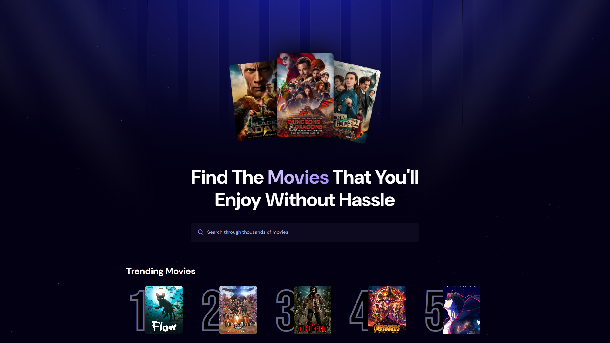
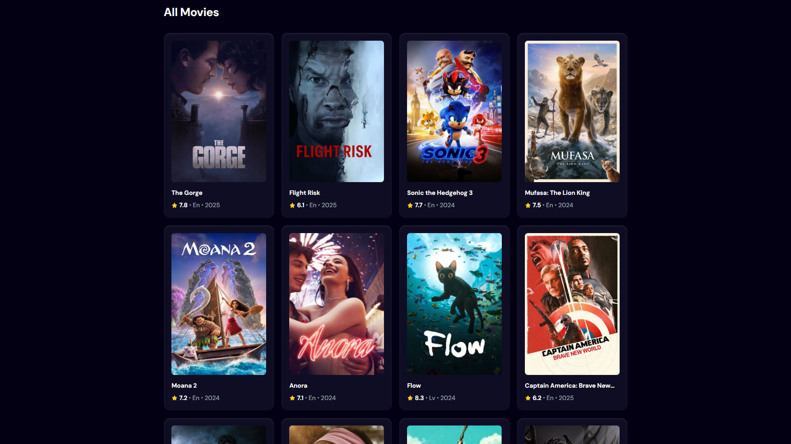

# 🎬 MovieFlix & Chill
**AI-Powered Movie Recommender**  
[🔗 Live Site](https://movie-flix-chill.vercel.app/)




Discover your next favorite film with ease. Powered by AI and real-time data, **MovieFlix & Chill** delivers personalized movie recommendations with infinite scrolling, trailer playback, and smart search functionality.

---

## 🚀 Features
- **AI-Powered Recommendations** – Discover movies tailored to your taste
- **Infinite Scroll Search** – Seamlessly browse through endless movie results
- **Trailer Playback** – Watch movie trailers directly in the app
- **Debounced Search** – Optimized search without API flooding
- **Trending Movies** – Real-time trending data via Appwrite
- **Responsive Design** – Perfect on all devices

---

## 🛠️ Tech Stack
- **Vite** – Lightning-fast build tool
- **React** – Component-based UI library
- **Tailwind CSS** – Utility-first styling
- **TMDB API** – Movie data and trailers
- **Appwrite** – Backend for tracking trends

---

## 🏃‍♂️ Quick Start

1. **Clone & Install**
   ```bash
   git clone https://github.com/whynotramaa/movie-recommendation.git
   cd movie-recommendation
   npm install
   ```

2. **Environment Setup**
   Create `.env` file:
   ```env
   VITE_TMDB_API_KEY=your_tmdb_api_key
   VITE_APPWRITE_ENDPOINT=https://your-appwrite-endpoint
   VITE_APPWRITE_PROJECT_ID=your_project_id
   ```

3. **Run Locally**
   ```bash
   npm run dev
   ```

---

## 🎯 Usage
- **Search**: Type any movie name for instant results with infinite scroll
- **Watch Trailers**: Click the play button on any movie card
- **Explore Trends**: Browse what's currently popular
- **Detailed Info**: View ratings, descriptions, and release dates

---

## 🐛 Known Issues
- Top 20 Movies feature disabled due to CORS limitations
- Rate limiting during peak TMDB API usage

---

## 🔮 Roadmap
- Fix CORS for Top 20 Movies
- User accounts & watchlists
- Mood-based recommendations
- Dark mode toggle
- PWA support
- Multi-language interface

---

## 🤝 Contributing
1. Fork the repo
2. Create feature branch: `git checkout -b feature-name`
3. Commit changes: `git commit -m "Add feature"`
4. Push & create pull request

---

## 📄 License
MIT License - see [LICENSE](LICENSE) file.

---

## 👨‍💻 Contact
Made with ❤️ by [@whynotramaa](https://github.com/whynotramaa)

**Connect:**
- GitHub: [@whynotramaa](https://github.com/whynotramaa)
- Issues: [Open an issue](https://github.com/whynotramaa/movie-recommendation/issues)

---

⭐ **Star this repo if you found it helpful!**
